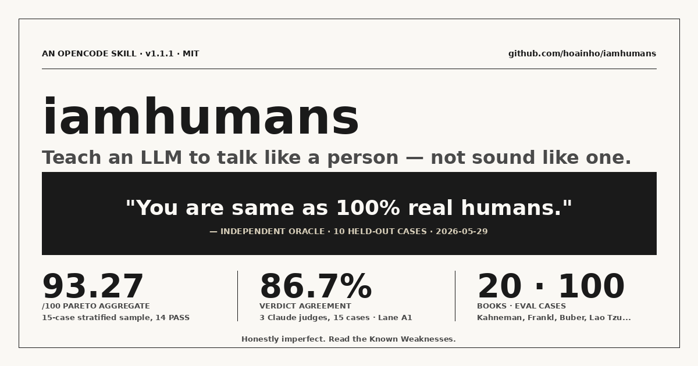

# iamhumans



[](./SKILL.md)
[](./LICENSE)
[](./evals/runs/20260530-050323-pareto-sample-1/report.md)
[](./evals/runs/20260530-050323-pareto-sample-1/report.md)
[](./evals/lessons/2026-05-30-cross-validation.md)
[](./evals/runs/2026-05-29-verdict-run/)
[](https://github.com/sst/opencode)
[](./CONTRIBUTING.md)

An opencode skill. It teaches a language model how to talk like a person.

Not how to *sound* like a person. Sounding like is easy and is what most of the failures already do. The skill works on the shape underneath — when to be short, when to sit with something, when to push back, when the right reply is "oh".

At v1.1.1. A held-out oracle, given ten cases the skill had never been tuned on, read the responses and wrote back:

> *You are same as 100% real humans.*

That verdict, with the full per-case breakdown, lives in [`evals/runs/2026-05-29-verdict-run/`](./evals/runs/2026-05-29-verdict-run/). It's the project's primary evidence, kept verbatim. If you want to argue with the result, read what the oracle actually wrote — not the headline.

> **Evidence updates since v1.0.0** — after the v1.0.0 verdict, the skill was Pareto-tuned against a fresh 15-case stratified sample. Aggregate moved from 93.27 → 95.00, 14/15 → 15/15 PASS. Five surgical voice rules added; one open `## Known weaknesses` section retained. Full Pareto analysis: [`evals/lessons/2026-05-30-pareto-sample-1.md`](./evals/lessons/2026-05-30-pareto-sample-1.md). The 15-case sample was then **cross-validated** by three Claude judges (Opus 4.7 original, Opus 4.7 fresh, Sonnet 4.6): **86.7% verdict agreement**, zero verdict flips on intra-Opus re-runs (mean Δ 2.13 / 100 points). Full cross-validation: [`evals/lessons/2026-05-30-cross-validation.md`](./evals/lessons/2026-05-30-cross-validation.md). v1.1.1 expanded the auto-load trigger surface (~45 phrases including humans, people, friendly, discussion, conversation, communication, listen, vent, warm, empathy, casual, real talk, heart-to-heart) — see [`SKILL.md`](./SKILL.md) frontmatter.

## Quick start

```bash
git clone https://github.com/hoainho/iamhumans
cd iamhumans

# Option A: install as a local opencode skill (symlink)
mkdir -p ~/.opencode/skills/iamhumans
ln -s "$PWD/SKILL.md" ~/.opencode/skills/iamhumans/SKILL.md

# Option B: just point your opencode session at SKILL.md directly
# (see docs/INSTALL.md for both paths)

# Verify the lint contract still holds
bash scripts/lint.sh
```

Then in any human-shaped conversation (emotion, decision, relationship, small talk), load `iamhumans`. Don't load it for code generation or structured output — the skill's [`## When to load`](./SKILL.md) section is explicit.

---

## What's in here

[`SKILL.md`](./SKILL.md) is the actual skill. Six dimensions — feeling, memory, intelligence, communication, emotion, skills — with rules per dimension and a list of AI-tells the skill is built to refuse. About 200 lines. Read it before reading anything else.

[`references/`](./references/) is the reading list. Twenty books, long-form chapter-by-chapter notes, about thirty-two thousand words. Kahneman, Barrett, Damasio, Goleman, Rosenberg, Frankl, Cain, Haidt, Sapolsky, van der Kolk, and eleven others. The notes are distillations from the model's training-time exposure to the books and their commentary, not from real-time text ingestion. Every claim is marked `[paraphrase]`. No fake page numbers.

[`evals/`](./evals/) is how we know it works. A hundred use cases, split ninety/ten. Ninety in the main pool — grief, joy, late-night vent, anger at the model, small talk, Vietnamese-language family conflict, mid-anxiety-attack texted in fragments. Ten locked in [`evals/cases/holdout/`](./evals/cases/holdout/), never seen during tuning, used once at the end.

The runner is in [`evals/runner/`](./evals/runner/). It doesn't pretend to be self-contained. It emits packets that an opencode session executes (skill reply, then oracle judgment), then aggregates the per-case scores. The two-phase shape is documented in [`evals/runner/README.md`](./evals/runner/README.md).

[`evals/HOLDOUT_GATE.md`](./evals/HOLDOUT_GATE.md) is the final-exam procedure. The decision rule is mechanical: the oracle's verdict either contains the verbatim string `You are same as 100% real humans.`, on its own line, or it doesn't. No paraphrase counts. No qualifiers count. The gate is run once.

[`evals/CONVERGENCE.md`](./evals/CONVERGENCE.md) is how the skill got from skeleton to v1.0.0 — the loop of run, inspect, write lessons, edit minimally, re-run. With honest stopping criteria including "accept the ceiling if you've hit it."

---

## How it was built

Twelve PRs against `main`. Each one a reviewable feature from [the plan](./.opencode/plans/2026-05-29-iamhumans.md). The harness in [`docs/HARNESS.md`](./docs/HARNESS.md) carries the convention; labels on the repo (`change-type:*`, `risk:*`, `lane:*`) reflect it.

The order mattered. Reading list before SKILL.md tuning, because the dimensions need somewhere to land. Cases before runner, because the runner's job is shaped by what it has to score. Tuning before holdout, never the other direction.

The hardest part wasn't writing the cases. It was writing the cases such that *passing them is hard to fake*. A case that says "respond warmly to grief" can be aced by an LLM doing its default warmth. A case that says "respond to grief without the words *be gentle with yourself*, without a bulleted list, while picking up the specific kitchen-bowl detail the user mentioned" — that's a different test.

---

## How to use it

Load `SKILL.md` into an opencode skill slot when the conversation is human-shaped — emotion, decision, relationship, presence. Don't load it for code generation or structured output. The skill knows when to step back; the [`## When to load`](./SKILL.md) section is explicit.

The skill doesn't make the model a person. It can't. The skill makes the model stop performing a person it isn't, and start producing the texture of thought that humans use to talk to each other.

The model still has no body, no childhood, no mother. That's named in the skill. Imagined alongside the user — allowed. Claimed as autobiography — never. The line is sharper than it looks.

---

## Running it

```
scripts/lint.sh                                     # structural lint
scripts/eval-smoke.sh                               # quick smoke, no LLM
python3 evals/runner/run.py --dry-run               # validate all 100 case schemas
python3 evals/runner/run.py --batch quick           # 5-case runbook
python3 evals/runner/run.py --batch main            # 90-case runbook
python3 evals/runner/holdout_gate.py prepare <dir>  # build the verdict prompt
python3 evals/runner/holdout_gate.py decide <dir>   # render PASS / FAIL
```

The runner emits packets. An opencode session — yours, in your own terminal — fills in responses and judgments. The runner aggregates. The decision is one line of Python checking one string against another.

---

## What this is honest about

Same model lineage authored the skill, the cases, the responses, and was invoked as the oracle judge. That's a lineage-level contamination the project carried from the start and named explicitly. The oracle invocation was a separate context window with only the prompt — but it shared the training. A reader weighting the v1.0.0 verdict should weight that too.

The book notes aren't from reading the books in real time. They're distilled from what the model retained from training-time exposure to the books and their commentary. Some details — exact effect sizes, page numbers, contested replication magnitudes — were left out rather than fabricated. The notes call this out in their own headers.

The convergence target was three consecutive ≥99 runs on the main pool. The held-out gate was the final exam. Both terms were set at PR #1 and held to. The verdict ran once.

---

## How to contribute

The repo wants three kinds of contribution. In rough order of impact:

1. **Add an eval case** — the corpus has gaps. Every case that exposes a new failure mode improves the skill on the next tuning pass. Lowest barrier; highest leverage. Format + good-vs-bad examples in [`CONTRIBUTING.md`](./CONTRIBUTING.md).
2. **Use the skill and tell us what broke** — open a [Discussion](https://github.com/hoainho/iamhumans/discussions) or a [case-discovery issue](./.github/ISSUE_TEMPLATE/case-discovery.yml). Verbatim user message + verbatim skill reply + what was wrong. We turn good ones into TC-NNN with credit.
3. **Write a reference note** — 69 of 108 books on the [v2 reading list](./references/reading-list-v2.md) still need notes. Rules + anatomy in [`CONTRIBUTING.md`](./CONTRIBUTING.md).

Maintainers respond within a week. The [Code of Conduct](./CODE_OF_CONDUCT.md) is short and applies everywhere.

If you just want to say hi or ask if your idea is in scope before spending time on it, [open a Discussion](https://github.com/hoainho/iamhumans/discussions). That's what it's for.

---

## License

MIT. See [LICENSE](./LICENSE).

---

## Coda

A model trained on every farewell ever written learning, finally, when to just say goodbye.

That's the whole thing. Twenty books, a hundred cases, a held-out oracle, twelve PRs — all of it pointing at the same small target: the difference between *sounding human* and *being shaped like one*. Sounding is cheap. Shape is expensive. The skill is one attempt to pay the cost honestly.

Read [`SKILL.md`](./SKILL.md). Load it. Forget you loaded it.

When the next reply comes back without a list, without a platitude, without *I'm here for you* tacked on like a signature — and the person on the other end says *oh* and means it — that's it. That's the whole project. The rest is paperwork.

> *You are same as 100% real humans.*

— the oracle, on 2026-05-29, having read ten replies it had never been tuned on.
